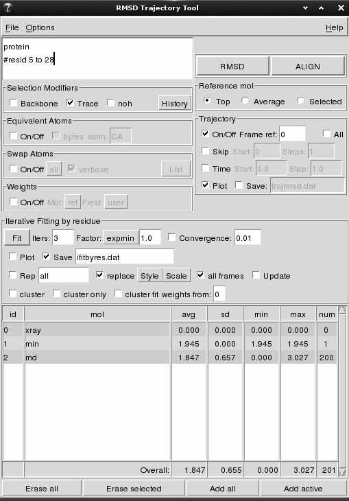

RMSDTT
=====

The **RMSDTT** VMD plugin original goal was to add support for rmsd calculations and alignment of trajectories to the [RMSD Tool](http://www.ks.uiuc.edu/Research/vmd/plugins/rmsd/) plugin. It has since evolved to:
* Calculate rmsd in trajectories, skip frames and do an all-to-all rmsd (all molecules/frames against each other).
* Calculate weighted rmsd.
* Align frames in trajectories.
* Plot results via the Multiplot VMD plugin (in all systems), Xmgrace (on unix systems) or MS Excel (on windows).
* Save results to file.
* Swap equivalent atoms (i.e. Glu OE1 and OE2) to reduce rmsd (if Swap plugin is available).
* Generate basic statistics (average, standard deviation, minima and maxima).
* Multi-line atoms selection with support for comments.
* Highlight equivalent atoms of the rmsd selection.

RMSDTT is distributed as part of VMD (RMSDTT 3.0 since version 1.8.8, RMSDTT 2.0 since version 1.8.4). Most recent information can be found at:

> Website: http://physiology.med.cornell.edu/faculty/hweinstein/vmdplugins/rmsdtt

As an example, the following figure shows the use of RMSDTT to calculate the rmsd of a single frame structure (*min*) and two trajectories (*equil* and *md*) with the *xray* structure as reference (*top* molecule). The trace (CA atoms) of the whole protein is used for the calculation. Note how lines can be commented in the atom selection box. Statistics for each molecule/trajectory and totals are shown in the table. In addition a plot was requested (plot not shown).



## Installation

A small guide on how to install third party VMD plugins can be found [here](http://physiology.med.cornell.edu/faculty/hweinstein/vmdplugins/installation.html). In summary:

1. Create a VMD plugins' directory if you don't have one, ie `/path/to/plugins/directory`.
2. Clone or download the project into a subdirectory of your *VMD plugins' directory* (ie. `/path/to/plugins/directory/rmsdtt`):
```sh
cd /path/to/plugins/directory
git clone https://github.com/luisico/rmsdtt.git rmsdtt
```
3. Add the following to your *$HOME/.vmdrc* file (if you followed the instructions in the link above, you might already have the first line present):
```tcl
set auto_path [linsert $auto_path 0 {/path/to/plugins/directory}]
vmd_install_extension rmsdtt rmsdtt_tk_cb "WMC PhysBio/RMSDTT"
```

Notes:
* The RMSDTT plugin v2.0 has been included in the VMD distribution since VMD 1.8.4, RMSDTT v3.0 since VMD 1.8.8. If you have a previous VMD version I recommend you upgrade.
* To be able to use MS Excel on Windows you will need the *tcom* tcl library. [Download](http://www.vex.net/~cthuang/tcom/) the library and install it (i.e. in your plugins directories) (in general, only the *tcom/lib/tcom* directory is needed). Then add the following to your *vmd.rc* file:
```tcl
lappend auto_path {/path/to/tcom/lib/tcom}
if { [catch "package require tcom" msg] } {
  puts "VMD tcom package could not be loaded:\n$msg"
}
```

## Getting started

RMSDTT has been enhanced quite a bit since it was first introduced back in 2004. Here is a short manual including all new options.

### Menu

* **File**: rmsd values are usually plotted or saved to file during the calculation using the plot and save to file options in the main window. Both options can also be triggered using **Save data** and **Plot data** from this menu. However, all *trajectory options* in the main window, except for *Time*, will not take effect when using **Save data** and **Plot data** from this menu, because the data is precalculated. **Save summary** will save to file a summary of the data as it appears in the table.

* **Options** allows you to change the definition of the backbone, select different programs for plotting, switch on/off the statistics in the table, and color the table by molecule number (only if this switch in on and the plot option is on during the calculation).

### Atoms Selection

The selection can be split in different lines. The character "#" can be used to comment out a portion of the selection from the "#" to the end of the line (see figure above).

* **Trace** will add "and name CA" to the atoms selection.
* **Backbone** will add "and name C CA N"' (default) or "and name C CA N O" to the atoms selection. The backbone definition can be selected from menu `(Options | Backbone def...)`.
* **noh** will exclude hydrogens from the atoms selection (adds "and noh" to the atoms selection).
* **History** is a drop down menu of previously used selections. It is updated only upon successful completion of *RMSD* or *ALIGN* calculations.

### Equivalent Atoms

This option draws yellow discontinued lines between pair of equivalent atoms.

* **byres** highlights only one atom per residue.
* **atom** specifies the atom name when using option *byres* If the atom is not found the first atom in the residue is used.

### Swap Atoms

This option tries to swap equivalent atoms to reduce the rmsd. Sets of equivalent atoms can be selected from the drop down menu (defaults to *All* defined pairs). How to define or delete new pairs is explained in the [Swap](http://physiology.med.cornell.edu/faculty/hweinstein/vmdplugins/swap) plugin webpage. You need to have the Swap plugin installed to see these options. It does not work with *ALIGN*.

* **verbose** will print the out the status of the swapped atoms during the RMSD calculations to the console.
* **List** will print out the current definitions to the console.

### Weights

Calculated a weighted rmsd or alignment using weights for each atom in the selection. Weight can be taken from different fields stored in one of the molecules:

* **Mol** will select the molecule storing the weights. *Ref* is the current molecule selected as reference (see below).
* **Field** will select the field storing the weights. Five fields can be used: *user*, *mass*, *charge*, *beta*, *occupancy*. Some are filled by VMD when loading the molecule, while others can be input using tcl.

### Calculation Type

* **RMSD** will calculate the rmsd using the reference molecule defined in *Reference Mol* and the structures in the table as targets. Note that the *RMSD* button has to be pressed again to obtain the new rmsd values after alignment.
* **ALIGN** will align the structures in the table using the molecule defined in *Reference Mol* as reference. *ALIGN* is not available if the *All* in the trajectory options is active, *Average* is used as reference or *Swap atoms* is active.

### Reference Molecule

Selects the molecule to use as reference for all rmsd and alignment calculations.

* **Top** uses the actual top molecule as reference (it doesn't need to be one included in the table).
* **Average** uses the average structure calculated from all the molecules in the table (and all frames if *trajectory* is activated) as reference. It does not work for *ALIGN* calculations.
* **Selected** uses the molecule selected in the table as reference. If more than one molecule is selected, only the first one will be used as reference.

### Trajectory Options

Include frames from trajectories of one or more molecules in the rmsd or alignment calculation.

* **Frame ref** sets the frame of reference for the reference molecule. if the reference molecule is set to *Average*, all frames are used.
* **All** activates the calculation of the rmsd of all frames in the selected structures against all frames in the reference molecule.
* **Skip** allows to skip frames, starting from *Start* and skipping every *Steps*.
* **Time** activates the use of time units. *Start* is the initial time, and *Step* is the time between frames. This changes will be reflected in the plot and the output file.
* **Plot** uses the *Multiplot VMD plugin* (available in all systems), *Xmgrace* (only on unix) or *MS Excel* (windows only) to plot the data *rmsd vs frame/time* during the calculation. This options is not available if the *All* option is on. The same plot can be obtained from the File menu after the calculation has finished(see above). Xmgrace or MS Excel have to be installed on the system by the user. MS Excel needs the tcom tcl library (see installation instructions). VMD gives a warning message when exiting on windows systems if MS Excel is open with data from VMD, but you still can continue using MS Excel.
* **Save** saves the data to the specified file during the calculation. Data can also be saved after the calculation has finished from the *File* menu (see above). The format of the data depends on the status of the *All* option. If it is off, the format is a table in which each row represents a frame and each column represents a molecule or trajectory. If *All* is on, the data is a table in which each row represents the rmsd between the corresponding *ref_mol/ref_frame* and *target_mol/target_frame* pairs. If the trajectories have differing numbers of frames, *NA* (not available) is used. The data can also be saved from the *File* menu.
```
              All off                                All on
    frame  mol 1  mol 2  mol 3       ref_mol  ref_frame   mol  frame   rmsd
        0  0.652  2.828  0.652             0          0     1      0  0.652
        1     NA     NA  0.659             0          0     2      0  2.828
        2     NA     NA  0.674             0          0     3      0  0.652
        3     NA     NA  0.692             0          0     3      1  0.659
        4     NA     NA  0.722             0          0     3      2  0.674
        5     NA     NA  0.743             0          0     3      3  0.692
      ...    ...    ...    ...           ...        ...   ...    ...    ...
```

### Iterative Fitting by residue

This section does an iterative fitting similar to that proposed by [Damm and Carlson](http://www.ncbi.nlm.nih.gov/pubmed/16565070) to make a biased fitting towards the common rigid regions among all the structures. In each iteration we first do a weighted fit of the selected atoms of all structures/conformations onto all other structures/conformations. The by-residue RMSD is then calculated for each fitted pair. Next, the average RMSD by-residue is calculated over all fitted pairs and converted into weights using the selected function. Weights obtained this way are fed in the next iteration.

An experimental clustering option is also included. Three distance metrics are calculated for each pair of structures/conformations: *rms* is the standard rmsd between conformations, *rmsw* is the standard weighted rmsd between conformations, and *lrmsw* is a special weighted function:
```
Dj = SUM(Wi * RMSDij) j=1...fitted pairs
```
where *Dj* is the distance metric for the fitted pair *j*, *RMSDij* is the RMSD of residue *i* in the fitted pair *j*, and *Wi* is the weight of residue *i* obtained in the last step of the iterative fitting, and the sum is over all residues of the protein.

The iterative fitting and cluster functions are very slow due to the number of calculations needed. But it can be accelerated by a hacked VMD and the tcl *tensor* package (see below).

The following options are available:
* **Fit** will start the iterative fitting.
  * **Iters**: number of iterations
  * **Factor**: function and factor used after each iteration to compute the new weights by residue. For each residue new weights are calculated based on one of the following formulas, where `factor` is the factor entered in the GUI, and `rmsd_mean_res` is the mean rmsd obtain during that iterations for a residue:
    * **linear**: `factor * rmsd_mean_res`
    * **exp**: `exp(-factor * rmsd_mean_res)`
    * **expmin**: `exp(-factor * (rmsd_mean_res - rmsd_global_min))`
    * **minmax**: `(rmsd_global_max - rsmd_mean_by_res) / (rmsd_global_max - rmsd_global_min)`
    * **gaussian**: ` exp(-(rmsd_mean_res^2) / factor)`
  * **Convergence**: can be used to stop the fitting before all iterations have completed. It represents the difference in weight change between iterations.
* **Plot**: check to get plot of rmsd by residue for each iteration.
* **Save**: check to save the results to file.
* **Rep**: check to display the results graphically in the main VMD window. You need to specify the atoms to represent, they don't need to be the same used in the fitting.
  * **replace**: reuse the same VMD representation for iterative fitting instead of creating a new one.
  * **Style**: select the style to use in the VMD representation.
  * **Scale**: select the color scale for the weights.
  * **all frames**: show all frames in the molecule.
* **Update**: update the representation (ie. weight scale) as iterations progress.
* **cluster**: do clustering of conformations based on the weights by residue.
  * **cluster fit**: fit structures before calculating the distance metric for each pair residues.
  * **cluster only**: do clustering based on current weights without running an iterative fitting.
  * **weights from**: use weights from this molecule (field user) when *cluster only* is selected.

#### Hacking *measure rmsd* in VMD
A patch for VMD can be found in [patches](patches). You will need to recompile VMD. It is compatible with the standard *measure rmsd* command, and adds two options:
  - *byres*: will return an array with all the rmsd by residue in the selection after the global rmsd.
  - *byatom*: will return an array with all the rmsd by atom in the selection after the global rmsd.

For example:
```tcl
lassign [measure rmsd $sel1 $sel2 byres] rmsd_global rmsd_byres

```

#### Using tcl package *tensor*
To make it available to vmd, download the package from http://web.eecs.umich.edu/~mckay/computer and install it. Assuming */path/to/your/vmdplugins* has been included in your *.vmdrc* autoload path:
```sh
cd /path/to/your/vmdplugins
wget http://web.eecs.umich.edu/~mckay/computer/tensor4.0a1.tar.gz
tar zxf tensor4.0a1.tar.gz
cd tensor4.0a1
./configure
make
```

### Table of target molecules

This table shows the results by molecule. It presents the average, standard deviation, minimum, maximum and number of frames used (note this number is different from the number of frames in the molecule when the reference molecule/frame is not included in the calculation). The Overall row shows the overall values as if all frames were independent of each other, i. e., it is not an average of the averages.

The following buttons can be used to add/remove molecules from the table (and further calculations):

* **Erase all** deletes all molecules from the list.
* **Erase selected** deletes the selected molecules from the list.
* **Add all** adds all molecules to the list.
* **Add active** adds only the active molecules to the list.

## Author

Luis Gracia (https://github.com/luisico)

Developed at Weill Cornell Medical College

## Contributors

Please, use issues and pull requests for feedback and contributions to this project.

### Thanks

Thanks to Joshua Speidel for his many contributions to this project.

## License

See LICENSE.
